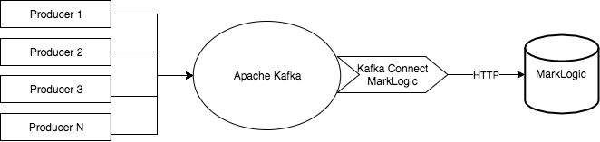

# Overview

Kafka Connect MarkLogic is a sink only connector to pull messages from Kafka to store in MarkLogic as JSON documents. Consider using Kafka MarkLogic Sync Connector for the following usecases.

1. Near realtime ingestion requirements.
2. Regulate the traffic towards MarkLogic.
3. Requirement to maintain the order of the messages. 
4. A Kafka ecosystem exists.
5. Replay messages using an offset.

## MarkLogic 8 Implementation 
Please refer to [this](https://github.com/sanjuthomas/kafka-connect-marklogic/tree/MARKLOGIC-8) branch for MarkLogic 8 version.

## High Level Architecture Diagram



This project is about the component marked in green. Refer [here](http://confluent.io/product/connectors) to see the available list of source connectors.

## Prerequisites

[Apache ZooKeeper](https://zookeeper.apache.org) and [Apache Kafka](https://kafka.apache.org) installed and running in your machine. Please refer to respective sites to download and start ZooKeeper and Kafka. 

## What is MarkLogic?
The MarkLogic is a multi-model schemaless NoSQL database to store, manage, and search JSON, XML, and RDF triples. For more details, please refer to MarkLogic official [website](marklogic.com).

## What is Apache Kafka?
Apache Kafka is an open-source stream processing platform developed by the Apache Software Foundation written in Scala and Java. The project aims to provide a unified, high-throughput, low-latency platform for handling real-time data feeds. For more details, please refer to [kafka home page](https://kafka.apache.org/).

## Implementation details 

To send data to MarkLogic, this connector make use of MarkLogic REST API. By default the /v1/documents endpoint at port 8000 is used. You may change that in the marklogic-sink.properties file. You may use your own REST/Service extension instead of the out of the box document API to do any transformation on the way in.

To listen to multiple topics, please add the topic name in the marklogic-sink.properties file. Current implementation will take the topic name and use it as the MarkLogic document collection name.

## Data Mapping

MarkLogic is a schemaless document store/NoSQL database. Since we are working with plain JSON data, we don't need a schema to serialize and deserialize the messages. 

**For stand-alone mode**, please copy ```kafka_home/config/connect-standalone.properties``` to create ```kafka_home/config/marklogic-connect-standalone.properties``` file. Open ```kafka_home/config/marklogic-connect-standalone.properties``` and set the following properties to false.

```
key.converter.schemas.enable=false
value.converter.schemas.enable=false
```

**For distributed mode**, please copy ```kafka_home/config/connect-distributed.properties``` to create ```kafka_home/config/marklogic-connect-distributed.properties``` file. Open ```kafka_home/config/marklogic-connect-distributed.properties``` and set the following properties to false.

```
key.converter.schemas.enable=false
value.converter.schemas.enable=false
```

In distributed mode, if you run more than one worker per host, the ```rest.port``` settings must have different values for each instance. By default REST interface is available at 8083.

## How to deploy the connector in Kafka?

This is maven project. To create an [uber](https://maven.apache.org/plugins/maven-shade-plugin/index.html) jar, execute the following maven goals.

```mvn clean compile package shade:shade install```

Copy the artifact ```kafka-connect-marklogic-1.0.jar``` to kakfa_home/lib folder.

Copy the [marklogic-sink.properties](https://github.com/sanjuthomas/kafka-connect-marklogic/blob/master/config/marklogic-sink.properties) file into kafka_home/config folder. Update the content of the property file according to your environment.

Alternatively, you may keep the ```kafka-connect-marklogic-1.0.jar``` in another directory and export that directory into Kafka class path before starting the connector.

## How to start connector in stand-alone mode?

Open a shell prompt, move to kafka_home and execute the following.

```
bin/connect-standalone.sh config/marklogic-connect-standalone.properties config/marklogic-sink.properties
```

## How to start connector in distribute mode?

Open a shell prompt, move to kafka_home and execute the following.

```
bin/connect-distributed.sh config/marklogic-connect-distributed.properties config/marklogic-sink.properties
```

## How to produce some messages?

A couple of example message producers are available [here](https://github.com/sanjuthomas/marklogic-kafka-sample-client).

## Contact

Create an issue in the GitHub.

## Contribute

Please refer to [CONTRIBUTING.md](https://github.com/sanjuthomas/kafka-connect-marklogic/blob/master/CONTRIBUTING.md)

## License
The project is licensed under the MIT license.

## Looking for a connector that supports XML messages?

Drop me a line - ml@sanju.org


