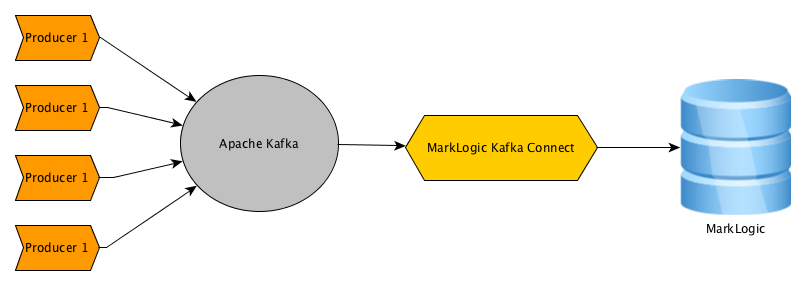

# Overview

Kafka Connect MarkLogic is a sink only connector (pull messages from Kafka to MarkLogic). Consider using Kafka MarkLogic Sync Connector for the following usecases.

1. Near Realtime ingestion requirements.
2. Regulate the traffic toward MarkLogic.
3. A Kafka echosystem exist.
4. Replay messages using an offset.

## What is apache kafka?
Apache Kafka is an open-source stream processing platform developed by the Apache Software Foundation written in Scala and Java. The project aims to provide a unified, high-throughput, low-latency platform for handling real-time data feeds. For more details, please refer to [kafka home page](https://kafka.apache.org/).

## Implementation details 

To send data to MarkLogic, this connector make use of MarkLogic REST API. By default the /v1/documents endpoint at port 8000 is used. You may change that in the marklogic-sink.properties file. You may use your own REST/Service extension instead of the out of the box document API to do any transformation on the way in.

To listen to multiple topics, please add the topic name in the marklogic-sink.properties file. Current implementation will take the topic name and use it as the MarkLogic document collection name.

## How to deploy the connector in Kafka?

This is a maven project. Do a mvn clean install, and it will produce an artifact "marklogic-kafka-connector-0.0.1-SNAPSHOT.jar". Copy that jar and it's dependencies (commons-logging-1.2.jar, httpclient-4.5.2.jar, httpcore-4.4.4.jar) in kafka_home/lib.

Copy the src/test/resources/marklogic-sink.properties file into kafka_home/conf folder. Update the content of the property file as per your environment.

Alternatively, you may keep the jar files in another directory and export that directory into class path before starting the connector.

## How to start connector in standalone mode?

Open a shell prompt, move to kafka_home and execute the following.

bin/connect-standalone.sh config/connect-standalone.properties config/marklogic-sink.properties

Since this example is not using any schema, please set the following properties to false in the kafka_home/conf/connect-standalone.properties file.

key.converter.schemas.enable=false
value.converter.schemas.enable=false

## How to produce some messages?

To produce some test messages, use the TestProducer class in the test source. Update the environment details like host, port, and topic in the TestProducer as per your environment.

## How to contact the author?

Create an issue in the GitHub.
 

